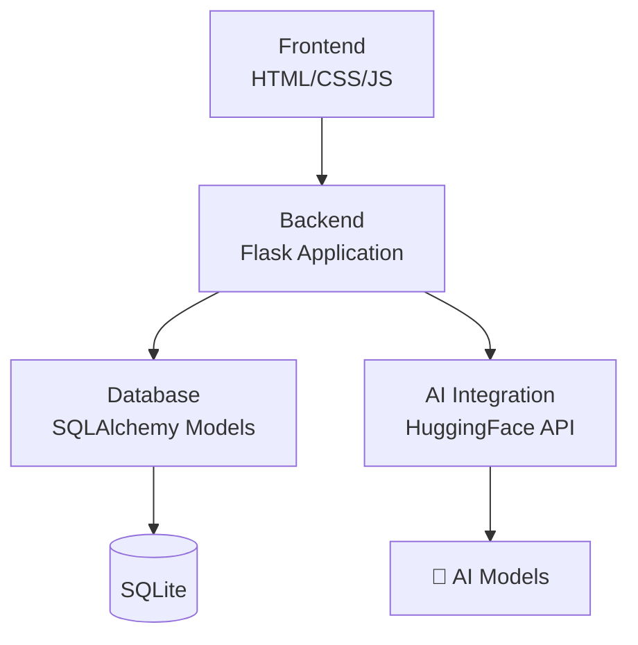

```markdown
# 🚀 Casecraft: AI-генератор программистских кейсов


**Веб-приложение для автоматической генерации уникальных практических заданий (кейсов) для программистов с использованием искусственного интеллекта.** Система создает персонализированные задачи различных уровней сложности за секунды.


## ✨ Ключевые возможности

### 🧠 **Умная генерация**
- **AI-движок**: Интеграция с HuggingFace API для создания контента
- **Адаптивная сложность**: Задачи для новичков, средних и опытных разработчиков
- **Тематическая гибкость**: Генерация кейсов по конкретным технологиям и языкам

### 📊 **Управление прогрессом**
- **Личный кабинет**: Все сгенерированные кейсы в одном месте
- **Система статусов**: Отслеживание выполнения (новый, в процессе, завершен)
- **Визуальная статистика**: Графики и метрики вашего развития

### 🔐 **Безопасность и удобство**
- **Полная авторизация**: Регистрация и безопасный вход
- **Адаптивный дизайн**: Работает на всех устройствах
- **Интуитивный интерфейс**: Современный UI/UX с анимациями

## 🏗️ Архитектура проекта



## 🛠️ Технологический стек

| Категория | Технологии |
|-----------|------------|
| **Backend** | Python 3.8+, Flask, SQLAlchemy, Flask-Login |
| **Frontend** | HTML5, CSS3 (Flexbox/Grid), JavaScript, Font Awesome |
| **AI & Data** | HuggingFace API, SQLite, Requests |
| **Инструменты** | Flask-WTF (CSRF), WTForms (валидация) |

## 🚀 Быстрый старт

### Предварительные требования
- Python 3.8 или выше
- pip (менеджер пакетов Python)
- Ключ API от HuggingFace (бесплатный)

### Установка и запуск за 3 шага

1. **Клонирование репозитория**
```bash
git clone https://github.com/LeonardoKotu/Casecraft.git
cd Casecraft
```

2. **Установка зависимостей**
```bash
pip install -r requirements.txt
```

3. **Настройка окружения**
```bash
# Создайте файл .env в корне проекта
echo "HUGGINGFACE_API_TOKEN=ваш_ключ_api_здесь" > .env
echo "SECRET_KEY=ваш_секретный_ключ_для_flask" >> .env
```

4. **Запуск приложения**
```bash
python app.py
```

После запуска откройте браузер и перейдите по адресу: **http://127.0.0.1:5000**

## 🎯 Использование

1. **Регистрация и вход**: Создайте аккаунт или войдите в систему
2. **Генерация кейса**: 
   - Выберите тему (например, "Базы данных", "Веб-разработка")
   - Укажите уровень сложности (Начинающий, Средний, Продвинутый)
   - Нажмите "Сгенерировать"
3. **Работа с кейсами**: 
   - Просматривайте историю всех заданий
   - Отмечайте статус выполнения
   - Редактируйте или удаляйте кейсы


## 📈 Статистика проекта

| Метрика | Значение |
|---------|----------|
| Количество страниц | 8 |
| Модели базы данных | 2 |
| Уровни сложности кейсов | 3 |
| Интегрированные AI-модели | 1+ |
| Поддерживаемые языки | Python, JavaScript, SQL, Java |
| Адаптивность | 100% |

## 🤝 Вклад в проект

Мы приветствуем вклад в развитие Casecraft! Чтобы внести свой вклад:

1. Форкните репозиторий
2. Создайте ветку для вашей функции (`git checkout -b feature/amazing-feature`)
3. Зафиксируйте изменения (`git commit -m 'Add some amazing feature'`)
4. Запушьте ветку (`git push origin feature/amazing-feature`)
5. Откройте Pull Request

## 📄 Лицензия

Этот проект распространяется под лицензией MIT. Подробнее см. в файле `LICENSE`.

## 👨‍💻 Автор

**Эсмурзиев Мухамед Мусаевич**
- Студент направления Data Science
- Группа: 3П2-9.23
- GitHub: [@LeonardoKotu](https://github.com/LeonardoKotu)


- Для `app.py` убедитесь, что у вас есть стандартная структура Flask-приложения с точкой входа

Удачи с вашим проектом! README получился информативным и профессиональным.
